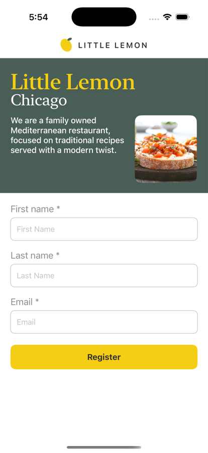
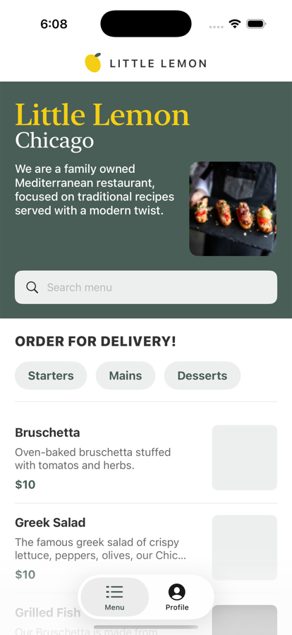
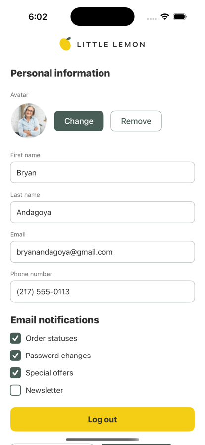
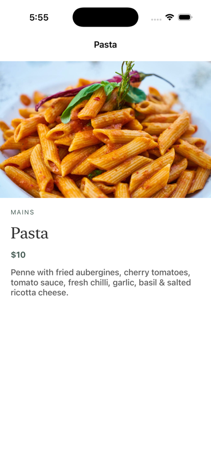

# Little Lemon iOS

A food-ordering app for the fictional Little Lemon restaurant, built with SwiftUI as the
capstone project for the **Meta iOS Developer Professional Certificate**.

The app registers a user, remembers them across launches, fetches the restaurant's menu
from a remote API, stores it in Core Data, and renders it with search and category
filtering.

| Onboarding | Menu | Profile | Dish details |
| --- | --- | --- | --- |
|  |  |  |  |

## Wireframe

The menu screen is built to this wireframe — navigation bar, hero, menu breakdown and
menu items:


## Features

- **Onboarding / registration** — first name, last name and email, validated before the
  user can continue.
- **Persisted session** — registration details and a login flag are stored in
  `UserDefaults`, so returning users skip straight to the menu. Logging out sends them
  back to registration.
- **Navigation flow** — onboarding → home → menu / profile, and menu → dish details.
- **Networking** — the menu is fetched over HTTPS and decoded with `JSONDecoder`.
- **Local database** — decoded items are written to Core Data as `Dish` entities and the
  UI reads from the database, not from the network response.
- **Sorting and filtering** — dishes are sorted by title with `NSSortDescriptor`, and
  narrowed by a search field and category pills using `NSPredicate`.
- **Profile management** — editable details, notification preferences, and save / discard.

## Requirements

- Xcode 26.x
- iOS 26.5 simulator or device (the deployment target is 26.5, so older runtimes will not
  resolve)

No package manager is used — the app relies only on first-party frameworks (SwiftUI,
Core Data, `URLSession`).

## Getting started

```bash
# Build
xcodebuild -project LittleLemonIos.xcodeproj -scheme LittleLemonIos \
  -destination 'platform=iOS Simulator,name=iPhone 17' build

# Run
xcrun simctl boot 'iPhone 17' && open -a Simulator
xcrun simctl install booted \
  ~/Library/Developer/Xcode/DerivedData/LittleLemonIos-*/Build/Products/Debug-iphonesimulator/LittleLemonIos.app
xcrun simctl launch booted com.example.LittleLemonIos
```

Or open `LittleLemonIos.xcodeproj` in Xcode and press Run.

## How the data flows

```
Menu.onAppear
   └─ getMenuData()
        └─ URLSession ──► menu.json
             └─ JSONDecoder ──► MenuList / MenuItem
                  └─ viewContext.perform
                       ├─ PersistenceController.clear()   (remove the previous menu)
                       ├─ Dish(context:) per item
                       └─ viewContext.save()
                            └─ FetchedObjects ──► List
```

Menu data comes from
[`Working-With-Data-API/menu.json`](https://raw.githubusercontent.com/Meta-Mobile-Developer-PC/Working-With-Data-API/main/menu.json).

The screen refetches every time it appears and replaces the stored menu, so the database
mirrors the latest response rather than accumulating rows.

## Project structure

| File | Responsibility |
| --- | --- |
| `LittleLemonIosApp.swift` | App entry point; loads `Onboarding` |
| `Onboarding.swift` | Registration form, `UserDefaults` keys, login check on launch |
| `Home.swift` | `TabView` shell; injects the Core Data view context |
| `Menu.swift` | Hero, search, category pills, dish list, fetch + persist |
| `DishDetails.swift` | Single dish screen |
| `UserProfile.swift` | Editable profile and notification preferences |
| `Theme.swift` | Design system: colours, type scale, shared components |
| `MenuList.swift` / `MenuItem.swift` | `Decodable` models for the API response |
| `Persistence.swift` | Core Data stack and menu reset |
| `FetchedObjects.swift` | Generic view that fetches managed objects into a closure |
| `ExampleDatabase.xcdatamodeld` | Core Data model containing the `Dish` entity |

`Persistence.swift` and `FetchedObjects.swift` were provided by the course.

## Design system

Colours live in `Theme.swift` as `Color` extensions.

| Token | Hex | Used for |
| --- | --- | --- |
| `llGreen` | `#495E57` | Hero background, filled buttons, prices |
| `llYellow` | `#F4CE14` | Wordmark, primary buttons |
| `llSalmon` | `#EE9972` | Validation messages |
| `llPeach` | `#FBDABB` | Soft secondary tint |
| `llCloud` | `#EDEFEE` | Search field, category pills, placeholders |
| `llCharcoal` | `#333333` | Body copy |

Little Lemon's brand pairs **Markazi Text** (display) with **Karla** (body). Those font
files are not bundled, so `Theme.swift` maps those roles onto the system serif and sans
faces. Adding the real fonts is a change to that one file.

Shared components: `BrandBar`, `HeroBanner`, `LemonMark`, `LabeledField`, `CategoryPill`,
`LemonCheckbox`, and the `LittleLemonButtonStyle` / `LittleLemonFilledStyle` /
`LittleLemonOutlineStyle` button styles.

## Known limitations

- **The store is not persistent.** `PersistenceController` points the store at
  `/dev/null`, as supplied by the course, so dishes live only for the session. The menu is
  refetched on every appearance, so this is invisible in normal use.
- **Two menu images are blank.** `grilledFish.jpg` and `lemonDessert 2.jpg` are solid
  black in the upstream API repository. The app renders what it is given.
- **Avatar Change / Remove are not wired.** The controls are in place to match the
  wireframe; image picking is not implemented.
- **No test target.** `xcodebuild test` fails until a unit test bundle is added.
